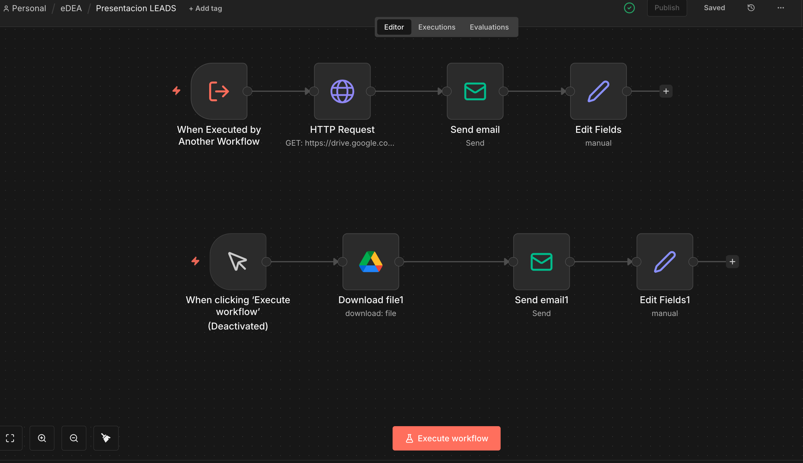

# Sales Pipeline & Lead Qualification System

Sistema integral de gestión de leads B2B vía WhatsApp. Orquesta la captación, calificación, análisis de sentimiento y seguimiento comercial automatizado con IA.

## Descripción General

Este módulo implementa un pipeline de ventas end-to-end que transforma conversaciones de WhatsApp en oportunidades de negocio cuantificables. Utiliza agentes de IA para entender intenciones, calificar leads en tiempo real y disparar acciones de seguimiento automáticas.

**Caso de Uso Primario:** Automatizar la captación de clientes B2B para servicios de automatización y marketing digital.

## Arquitectura del Sistema

Los 3 workflows se comunican mediante triggers y comparten una base de datos SQL centralizada.

```
WhatsApp Webhook
     ‚Üì
[1] Lead Qualification Bot (An√°lisis en vivo)
     ‚Üì (Guarda datos)
  PostgreSQL
     ‚Üì
[2] Sales Dashboard Backend (Procesa & enriquece)
     ‚Üì
  Lead Score > 60?
     ↓ (SÍ)
[3] Presentation Sender (Envía material)
     ‚Üì
  Cliente recibe PDF
```

---

## Flujos Incluidos

### 1. Lead Qualification Bot (`lead-qualification-bot.json`)

**Propósito:** Maneja la conversación con el cliente en tiempo real y extrae inteligencia comercial.

**Capacidades:**
- Reconocimiento de intenciones naturales (preguntar, interesado, rechaza).
- Extracción automática de datos: Nombre, Empresa, Email, Teléfono.
- Generación de respuestas contextuales con OpenAI GPT-4o-mini.
- Logging completo de cada interacción en la base de datos.
- Enrutamiento inteligente (humano vs. bot) seg√∫n temperatura del lead.

**Inputs (vía webhook de WhatsApp):**
- `message`: Texto del cliente.
- `remote_jid`: ID √∫nico del cliente en WhatsApp.
- `timestamp`: Hora del mensaje.

**Outputs:**
- Respuesta autom√°tica enviada al cliente.
- Record guardado en tabla `leads` con an√°lisis de sentimiento y NLU.

**Integrations:** OpenAI, PostgreSQL, Evolution API (WhatsApp).

**Vista previa del flujo:**


---

### 2. Sales Dashboard Backend (`sales-dashboard-backend.json`)

**Propósito:** Procesa los datos crudos del chat y genera métricas de negocio.

**Capacidades:**
- C√°lculo de Lead Score (0-100) basado en engagement y datos capturados.
- An√°lisis de Trayectoria Emocional (Improving/Declining/Stable).
- Detección de logros:
  - Email capturado.
  - Reunión agendada con fecha/hora confirmada.
  - Presentación enviada.
  - Seguimiento confirmado.
- Clasificación de Lead Status: Prospect → Lead Qualified → Meeting Booked → Lost.
- Almacenamiento en tabla `leads_analytics_summary` para BI/Dashboards.

**Lógica Crítica:**
- Si `capture_goal_achieved = "email_captured"` Y `lead_score > 60` → Dispara envío de presentación.
- Si cliente rechaza 3 veces ‚Üí Mark as Lost.
- Si no hay interacción en 7 días → Lead goes Cold.

**Integrations:** PostgreSQL, OpenAI (an√°lisis avanzado de sentimiento).

**Vista previa del flujo:**


---

### 3. Presentation Sender (`presentation-sender.json`)

**Propósito:** Envía material comercial automáticamente cuando el lead está calificado.

**Capacidades:**
- Descarga del PDF de presentación desde Google Drive.
- Generación de email personalizado con nombre del negocio/cliente.
- Envío SMTP a email capturado.
- Registro de envío en base de datos.
- Notificación al equipo de ventas (Telegram/Email).

**Trigger:** Ejecutado por Dashboard Backend cuando se cumplen condiciones.

**Inputs:**
- `nombre-negocio`: Extraído del chat.
- `correo-cliente`: Extraído del chat.

**Integrations:** Google Drive, SMTP, Telegram.

**Vista previa del flujo:**


---

## Instalación y Configuración

### Requisitos Previos

1. **Instancia de n8n** (self-hosted o cloud).
2. **Base de Datos PostgreSQL** con las siguientes tablas:
   ```sql
   CREATE TABLE leads (
     id SERIAL PRIMARY KEY,
     remote_jid VARCHAR(50) UNIQUE,
     nome_negocio VARCHAR(255),
     email VARCHAR(255),
     phone VARCHAR(20),
     first_message_at TIMESTAMP,
     last_message_at TIMESTAMP,
     conversation_history JSONB,
     sentiment_score FLOAT,
     lead_score INT DEFAULT 0,
     status VARCHAR(50) DEFAULT 'Prospect',
     created_at TIMESTAMP DEFAULT CURRENT_TIMESTAMP
   );

   CREATE TABLE leads_analytics_summary (
     id SERIAL PRIMARY KEY,
     remote_jid VARCHAR(50),
     capture_goal_achieved VARCHAR(50),
     capture_status VARCHAR(50),
     lead_score INT,
     temperature VARCHAR(20),
     presentation_sent BOOLEAN DEFAULT FALSE,
     presentation_sent_at TIMESTAMP,
     created_at TIMESTAMP DEFAULT CURRENT_TIMESTAMP
   );
   ```

3. **Credenciales Necesarias:**
   - OpenAI API Key (para GPT-4o-mini).
   - Evolution API Key (para WhatsApp).
   - Google Drive OAuth (para acceso a PDFs).
   - SMTP Credentials (para envío de emails).
   - PostgreSQL Connection String.

### Pasos de Instalación

1. Importa cada archivo JSON en n8n:
   - En tu instancia: **Import > From File**.
   - Selecciona los 3 archivos en orden: Bot ‚Üí Dashboard ‚Üí Sender.

2. Configura las credenciales:
   - Abre cada workflow y reconecta las cuentas de OpenAI, Google, PostgreSQL y SMTP.

3. Configura los triggers:
   - El Lead Bot debe escuchar webhooks de Evolution API.
   - Configura el webhook URL en tu instancia de Evolution.

4. Prueba el flujo:
   - Envía un mensaje de prueba desde WhatsApp.
   - Verifica que se cree un registro en PostgreSQL.
   - Confirma que el Dashboard procese los datos correctamente.

---

## Flujo de Datos (Ejemplo)

```
Cliente: "Hola, tengo un restaurante y quiero mejorar mi marketing digital"
  ‚Üì
Lead Bot: Extrae intent="interested", topic="marketing", empresa="restaurante"
  ‚Üì
Dashboard: Calcula lead_score=65, temperature="Warm", status="Lead_Qualified"
  ‚Üì
Presentation Sender: "Lead Score > 60? Sí → Envía presentación a email@cliente.com"
  ‚Üì
Cliente recibe: "Estimado, como conversamos vía WhatsApp, le envío nuestra presentación..."
```

---

## Notas de Seguridad

- **No se incluyen secretos en los JSONs.** Todos los tokens se gestionan a través del sistema de credenciales de n8n.
- **Datos de clientes:** No se guardan números de teléfono ni emails hardcodeados. Se extraen dinámicamente del chat.
- **Prompts de IA:** Est√°n optimizados para ser neutrales y reutilizables. Personaliza los ejemplos en los nodos `Code` seg√∫n tu vertical.

---

## Monitoreo y Troubleshooting

### Logs Recomendados
- Habilita "Save Data" en cada nodo para debugging.
- Revisa la tabla `leads_analytics_summary` regularmente.
- Configura alertas si `lead_score` cae abruptamente (puede indicar rechazo del cliente).

### Problemas Comunes
| Problema | Causa | Solución |
|----------|-------|----------|
| El bot no responde | Evolution API no conectada | Verifica webhook URL en Evolution |
| Lead Score = 0 | Prompt de OpenAI con error | Revisa el nodo "Analyze with GPT" |
| Presentación no se envía | Email incorrecto extraído | Agrega validación en nodo "Validate Email" |

---

## Customización

### Cambiar el PDF de Presentación
1. Sube tu PDF a Google Drive.
2. Copia el File ID desde la URL de Drive.
3. En `presentation-sender.json`, nodo "Download file", reemplaza el `fileId`.

### Ajustar Lead Score
En el nodo `Code` del Dashboard, modifica los pesos:
```javascript
let score = 0;
if (capture.email) score += 30;
if (capture.meeting_scheduled) score += 50;
if (sentiment > 0.7) score += 20;
return score;
```

### Agregar Nuevos Canales
El sistema está diseñado para escalarse. Si quieres agregar Telegram o SMS:
1. Agrega un nodo de trigger adicional para ese canal.
2. Mapea los datos al mismo formato de `remote_jid` y `message`.
3. Reutiliza el mismo Bot y Dashboard.

---

## Referencias y Recursos

- [n8n Workflows Documentation](https://docs.n8n.io)
- [OpenAI API Reference](https://platform.openai.com/docs)
- [Evolution API WhatsApp](https://evolution-api.com/)
- [PostgreSQL JSON Support](https://www.postgresql.org/docs/current/datatype-json.html)

---

**Versión:** 1.0 | **Última actualización:** Enero 2026 | **Desarrollado por eDEA SpA**

## Frontend Dashboard

El repositorio incluye un dashboard React completo para visualizar y gestionar los leads. Para m·s detalles tÈcnicos y de instalaciÛn, consulta el [README del Frontend](./frontend/README.md).

